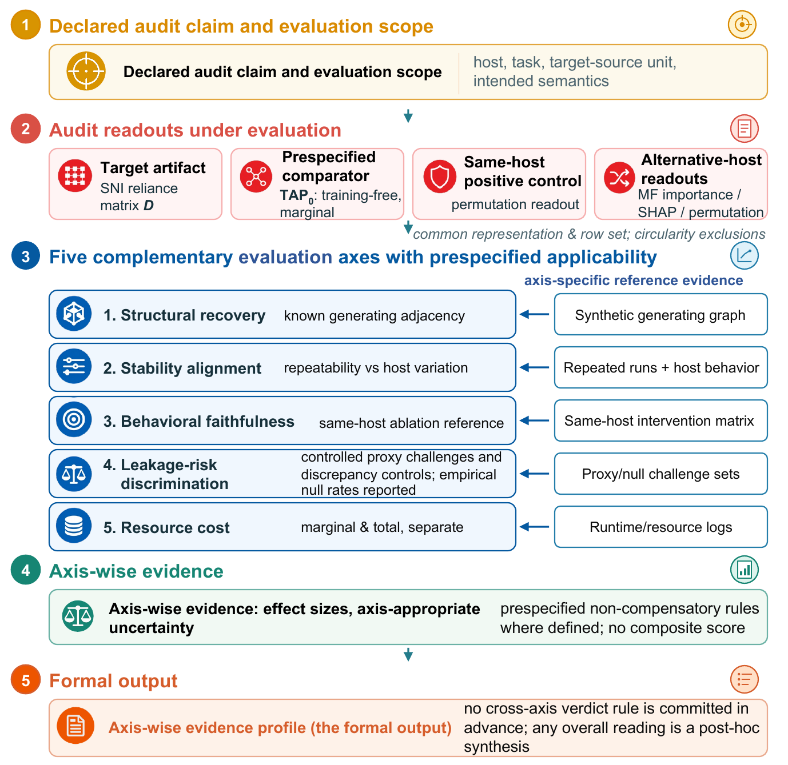

# VERA -- a five-axis evaluation protocol for claimed audit artifacts

This repository accompanies the paper *"Evaluating intrinsic and post-hoc audit artifacts for imputation of mixed-type health data"* (Health Information Science and Systems, under revision). It contains the complete code for **VERA** (ground-truth recovery, reproducibility, faithfulness, cost, leakage detection), the training-free baseline **TAP**, the SNI imputer under test, the missingness simulator, the benchmark harness, and every prospectively specified decision-rule document.

*The five-axis protocol at a glance. Full caption, the vector original and its checksum: [`docs/figure/`](docs/figure/). The figure is the authors' own work and is not covered by the MIT license below.*

## Provenance and the evidence bundle

This public repository is a **fresh tree**: the original development history contains restricted-access derived tables (MIMIC-IV / eICU, both under data use agreements) and is therefore retained privately, available to editors on request. The directory **`prereg_archive/`** is the hash-stable evidence layer for the prospective-specification chain: it preserves every rule document together with its original commit hashes, the zero-artifact attestation texts from the commit bodies, a manifest,
and SHA-256 checksums. Commit hashes cited in the paper and in review responses refer to this archived evidence bundle. The rules and their original commit hashes are preserved here, released as [`v1.0.0`](../../releases/tag/v1.0.0). A commit hash fixes the content of this bundle exactly, but a hosting account is not an archive: the history can be replaced by whoever controls it, and this tree has been replaced twice already while it was being prepared. We therefore claim no independent no-later-than anchor for the bundle. An independent archival deposit is intended and will be cited here when it completes.

## What is (deliberately) not here

- **Row-level derived tables** for MIMIC-IV and eICU: restricted access; obtain credentials via PhysioNet / the eICU CRD and run the data-layer builders in `data_layer/`.
- **Trained model weights**: derivatives of restricted data; reproducible from code + seeds + the environment lock.
- **Frozen mask files**: table-shaped derivatives of the above. Regenerate with `python -m missingness.cli generate` under `configs/missingness.yaml` and verify against `data_manifests/masks_sha256_manifest.json`.

## Reproduction

1. Environment: `environment.lock.yml` / `requirements.lock.txt` (Python 3.10; BLAS threads and `PYTHONHASHSEED` discipline are enforced by the entry points themselves -- runs refuse to start without `PYTHONHASHSEED` set).
2. Data: build derived tables via `data_layer/` (public sets download directly; MIMIC/eICU need credentials), then regenerate masks and verify checksums.
3. Experiments: see the module docstrings under `experiments/` -- every stage prints its exact invocation. The prospectively specified decision rules live in `prereg_archive/` together with their original commit evidence (they were committed before the measurements they govern); `docs/` carries the adjudicated configuration register (asserted by `tests/test_adjudications.py`) and the corrections ledger the Online Resource's ledger ids point to.

## AI-assisted workflow

The authors used Anthropic Claude to assist with code development, execution of the specified analyses, and manuscript drafting. The authors directed and reviewed all work and take full responsibility for the content of the publication. This section is a fuller account of that workflow than the paper's declaration carries.

**Scope.** Statistical rule drafting, experiment design, analysis code, artifact generation, and the machine checks described here. It did not extend to data access: the restricted tables were handled under the data use agreements by the authors.

**Measured, not estimated.** A commit counts as AI-assisted when it carries a `Co-Authored-By: Claude` trailer, written by the tooling on every such commit. Across the development history: **294 of 330 commits**, by category -- artifact generation 162, experiment design 133, audit and verification 122, manuscript drafting 81, analysis code 59, text editing 47, statistical rule drafting 45, interpretation supplement 32, uncategorized 17, discussion blueprint 6. **These counts come from the private development history, not from this repository:** this is a fresh single-commit tree, so the trailers cannot be counted here. `experiments/ai_usage_inventory.py` ships and regenerates the table from a checkout that has that history.

**What the authors kept.** Every decision rule was fixed before its measurement and committed with a zero-artifact attestation. Every verdict is computed by code from a single evidence source, never typed. Where a machine check and a written claim disagreed, the claim was corrected.

## License

MIT -- see [`LICENSE`](LICENSE). The MIT terms cover the SOFTWARE here. They do not grant rights to data this repository does not contain: the MIMIC-IV and eICU derived tables are restricted-access and are not distributed, and neither are trained weights or the frozen mask files. `prereg_archive/` is an evidence bundle, hash-stable by design; redistribute it unchanged or not at all.
